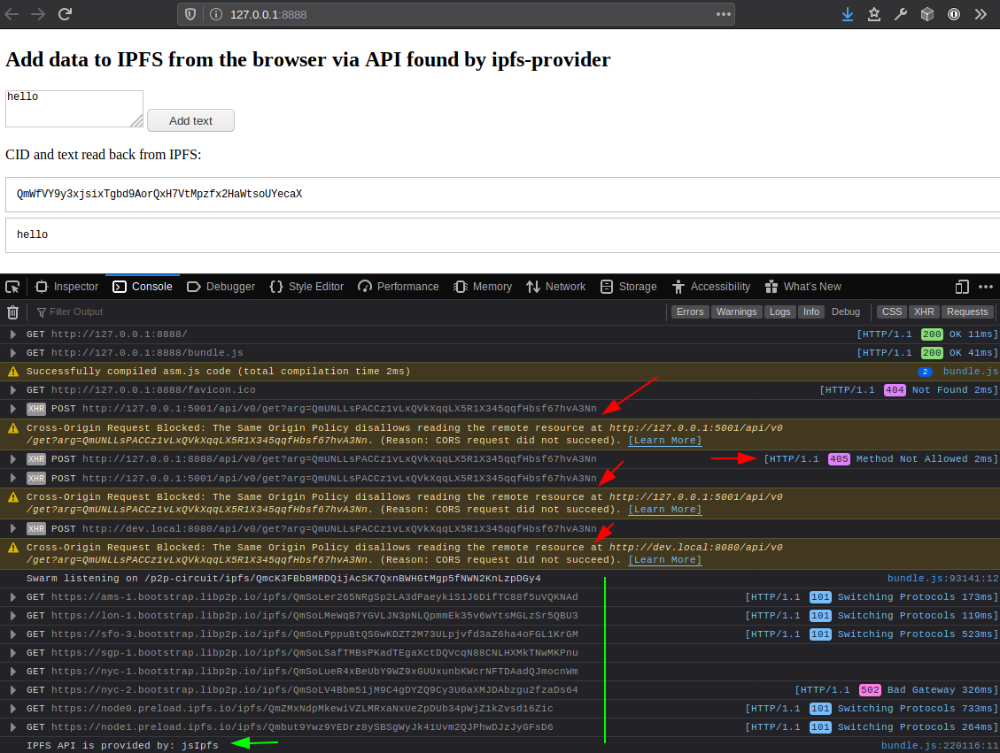

# Bundle `ipfs-provider`, `js-ipfs-http-client` and `js-ipfs` with Browserify!

> In this example, you will find a boilerplate you can use to guide yourself
into bundling everything with browserify, so that you can use it in your own web app
for a robust IPFS fallback.

## Run this example

Make sure `ipfs-provider` is built first, as this demo uses local version of `ipfs-provider` at `file:../../`

```console
$ npm install # all dependencies
$ npm start
```

Now open your browser at `http://localhost:8888`

## Fallback explanation

After loading `http://localhost:8888` you should see something similar to the following:

> 

Let's unpack what happened in the above example:

1. 🔴 there was no `window.ipfs` (no [ipfs-companion](https://github.com/ipfs/ipfs-companion), or disabled by user)
2. 🔴 test request to local API (`/ip4/127.0.0.1/tcp/5001`) was blocked due to [CORS protection](https://developer.mozilla.org/en-US/docs/Web/HTTP/CORS)
3. 🔴 `/api/v0/` on the same Origin as the page did not exist
3. 🔴 explicitly defined remote API was offline (`http://dev.local:8080`)
4. 💚 final fallback of spawning embedded [js-ipfs](https://github.com/ipfs/js-ipfs) was executed successfully 🚀✨
